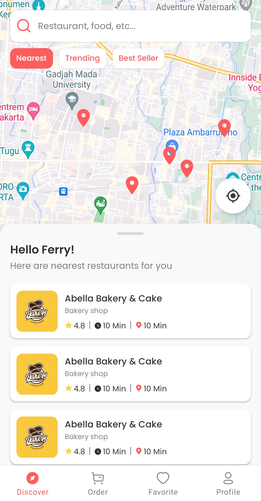
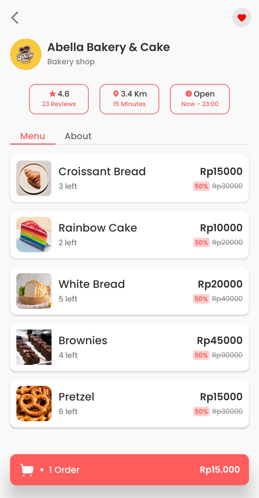
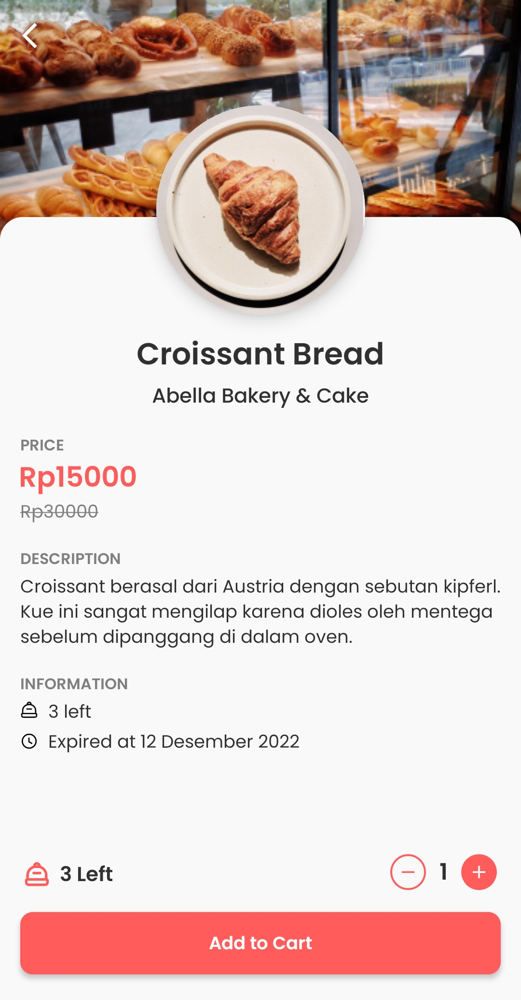
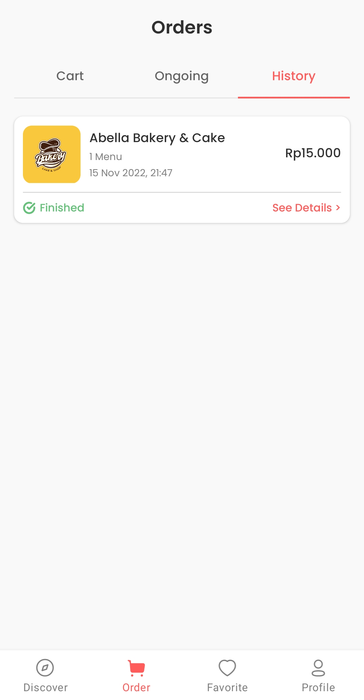
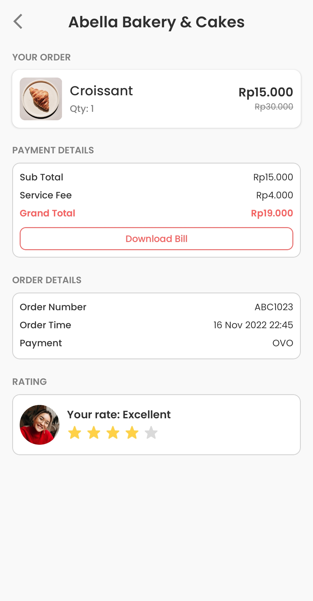

# Food Plus: Surplus Food Rescuer
Food+ is an android app that allows restaurants to sell their surplus food at a more affordable price.

## Description
This project is only an android interface or not yet connected to the backend service. 
Note : Before run the app, you need a Google Maps API key. Once you have your API key, define a new property in your
project's local.properties file (e.g. MAPS_API_KEY=Aiza...).

## User Interface

 

